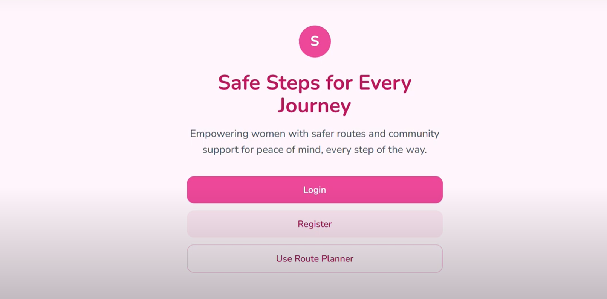
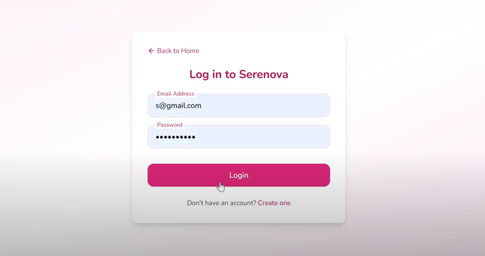
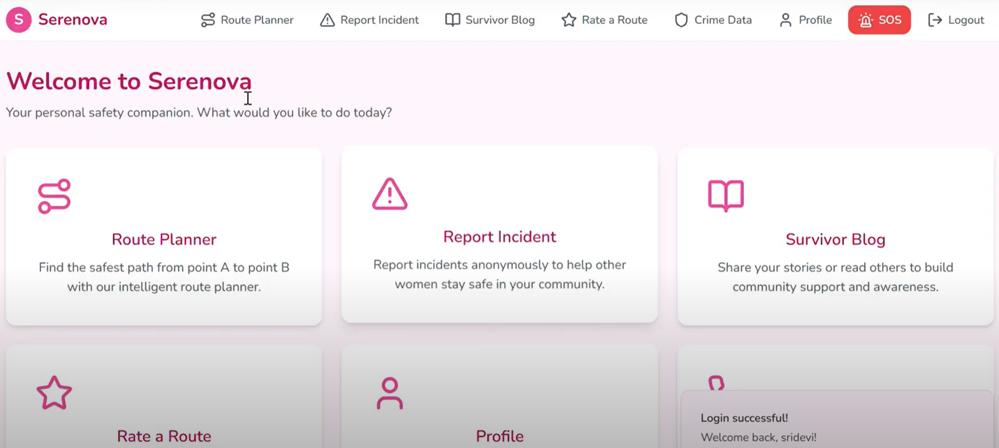
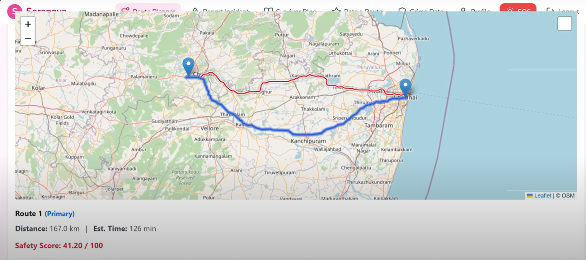
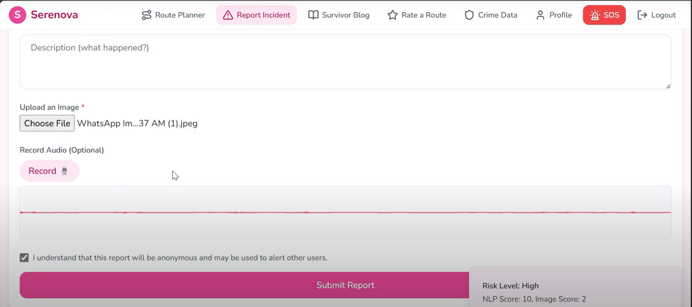
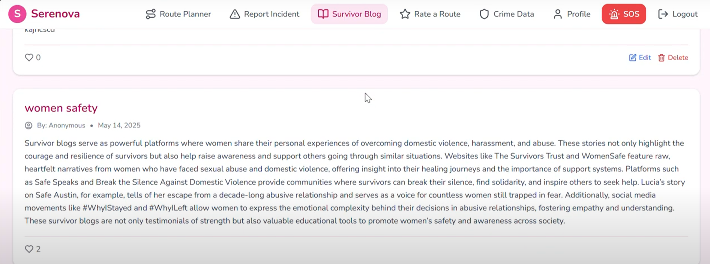
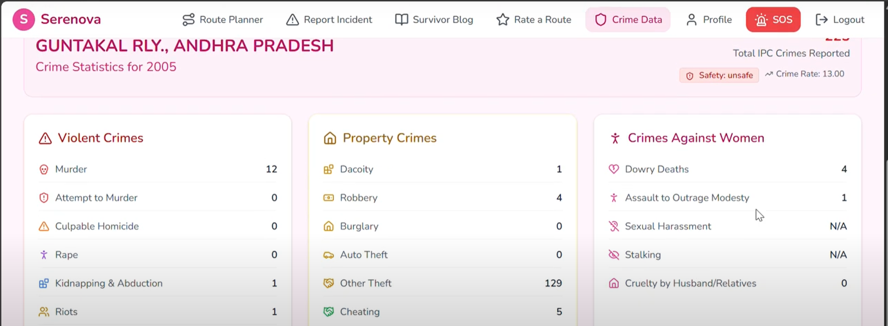
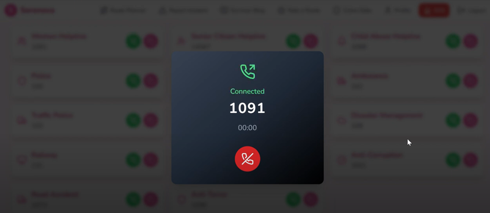
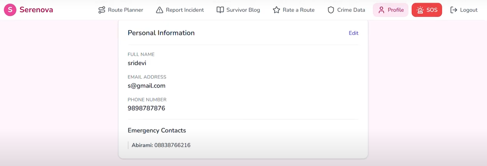
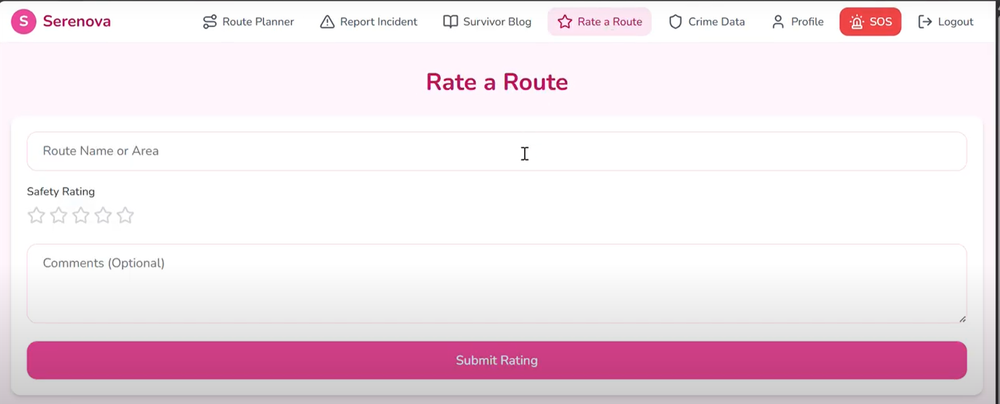

# 🚶‍♀️ Serenova: Safe Pathways

**Serenova** is an AI-powered women’s safety application that helps users find safe routes, report incidents, and connect with a supportive community. It leverages real-time data and machine learning to provide personalized, reliable safety recommendations.

---

## 🎥 Project Demo

Watch the demo on YouTube:  
[](https://www.youtube.com/watch?v=Cl1kOJUV7_4)

---

## 🌟 Features

- 🧠 **AI-powered Safe Route Planner** using real-time crime data, lighting, and crowd density  
- 🛡️ **Anonymous Incident Reporting** with safety heatmaps  
- ✍️ **Survivor Storytelling Blog** for sharing experiences and healing  
- 🚨 **Emergency SOS and Live Location Tracking**  
- 🌍 **Crowdsourced Route Ratings and Safety Tips**  
- ⭐ **Rate a Route** to share feedback and help others choose safer paths  
- 💡 **Intuitive and User-Friendly Interface**

---

## 📸 Project Screenshots

| Screen | Preview |
|--------|---------|
| **1. Home Page** |  |
| **2. Login Page** |  |
| **3. Dashboard Page** |  |
| **4. Safe Route with Safety Score** |  |
| **5. Report Incident Page** |  |
| **6. Survivor Blog Page** |  |
| **7. Crime Data Page** |  |
| **8. Helpline Page** |  |
| **9. Profile Page** |  |
| **10. Rate a Route Page** |  |


---

## 🛠️ Technologies Used

- **Python** – Backend and ML models  
- **React.js** – Frontend web app  
- **MongoDB** – Database for user data and incident reports  
- **Flask** – Backend API server  
- **Machine Learning** – For route safety prediction and analysis  

---

## 📁 Project Structure

```
/backend      # Flask API server and ML model code  
/frontend     # React.js web application  
/templates    # HTML templates (if applicable)  
/screenshots  # Screenshots for documentation  
/venv         # Python virtual environment  
```

---

## ⚙️ Installation & Setup

### ✅ Prerequisites

- Python 3.8+  
- Node.js and npm  
- MongoDB running locally or hosted

### 🚀 Backend Setup

```bash
cd backend
python -m venv venv
source venv/bin/activate  # Windows: venv\Scripts\activate
pip install -r requirements.txt
python app.py
```

### 🌐 Frontend Setup

```bash
cd frontend
npm install
npm start
```

---

## 🤝 Contributing

Contributions are welcome! Feel free to open issues or submit pull requests to improve Serenova. Make sure to follow best practices for code and documentation.

---

## 📬 Contact

Created by **Sridevi**  
🔗 [GitHub Profile](https://github.com/Sridevi2108)  

---

## 📝 License

This project is licensed under the MIT License – see the [LICENSE](LICENSE) file for details.
