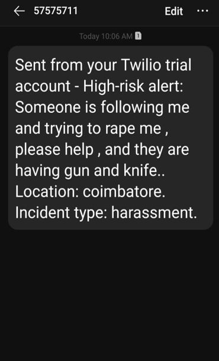

# 🌸 Serenova: Safe Steps for Women

---

## 🚨 Problem Description

"**Serenova: Safe Steps for Women**" is a safety-focused application that uses machine learning to enhance women's security. It offers intelligent route planning, risk classification, crime data visualization, and a survivor community space. Real-time and historical data are used to generate safety insights and enable emergency responses.

---
## 🎥 Project Demo

Watch the demo on YouTube:  

---

## 🌟 Core Features

### 1. 🗺️ Smart Route Planning with Safety Score
- Users input source and destination.
- System displays multiple route options with a **Safety Score** based on district-wise crime data in India.
- **ML Technique**:  
  - `XGBoost` is trained on crime type, crime rate, and geolocation data to predict route safety.

---

### 2. 🚨 Incident Reporting and Risk Classification
- Accepts **natural language** descriptions of incidents like *“someone is following me”*.
- Classifies risk level as **Low**, **Medium**, or **High**.
- Sends **emergency alerts** to police if risk is high.

**ML Techniques Used:**
- NLP with `TF-IDF` + `Logistic Regression` or `SVM`
- Optionally supports **BERT / Transformer Models**

---

### 3. 💬 Survivor Blog
- A secure space where survivors can share their stories and support each other.

---

### 4. 📊 Crime Data Visualization
- Search any city/district.
- Get interactive **charts and graphs** showing crime rates, types, and trends.
- Estimate safety levels of locations.

---

### 5. 📞 Emergency Helpline & Profile Management
- Quick access to helplines.
- Profile management for safety alerts and communication.

---

## 🛠️ Technologies Used

- **Frontend**: React.js  
- **Backend**: Python  
- **Map Integration**: Google Maps API  
- **Database**: MongoDB  
- **SMS Alerts**: Twilio API  
- **Datasets Used**:
  - District-wise crime data (1 lakh+ entries)

---

## 🤖 Machine Learning Models

- `XGBoost`: Route safety prediction
- `Logistic Regression` / `SVM`: Risk classification
- `TF-IDF` / `CountVectorizer`: Text feature extraction
- `BERT` (optional): Advanced NLP

---

## 🎯 Project Impact

Serenova delivers real-time safety intelligence, alerts, and guidance for women. Through seamless UI and AI, it empowers users to make safer choices, promotes awareness, and bridges the gap between danger and support.

---

## 📁 Folder Structure

/screenshots/
├── crime_data.png  
├── dashboard.png  
├── helpline.png  
├── homepage.png  
├── login.png  
├── profile.png  
├── rate_route.png  
├── report_incident.png  
├── route_safety_score.png  
├── sos_alert.png  
├── survivor_blog.png  

---
## 🤝 Contributing

Contributions are welcome! Feel free to open issues or submit pull requests to improve Serenova. Make sure to follow best practices for code and documentation.

## 📬 Contact

For queries or collaborations, reach out to any team member. We believe safety is a shared responsibility.  
Sridevi 🔗 [GitHub Profile](https://github.com/Sridevi2108)  
Abirami  🔗 [GitHub Profile](https://github.com/Abirami0502)
